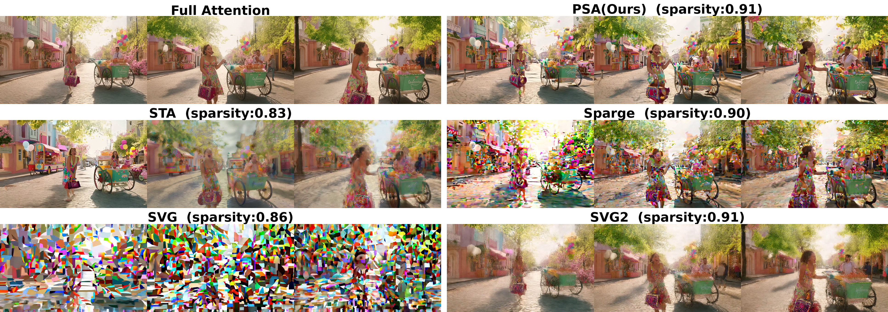

# Pyramid Sparse Attention (PSA)

[**English**](README.md) | [**中文**](README_zh.md)

**Website:** [http://ziplab.co/PSA](http://ziplab.co/PSA) | **Paper:** [arXiv](https://arxiv.org/abs/2512.04025)

Official PyTorch implementation of [PSA: Pyramid Sparse Attention for Efficient Video Understanding and Generation](https://arxiv.org/abs/2512.04025).

<p align="center">
  
</p>

<p align="center"><em>Visual comparison of sparse attention methods at similar sparsity levels (~90%). PSA maintains visual fidelity close to full attention while other methods show noticeable artifacts.</em></p>

> **Note:** This release focuses on **inference-only**. Backward propagation (training) is still under optimization and will be released in a future update. Causal attention is supported via the legacy kernel, see [qwen2.5-vl-example/](qwen2.5-vl-example/) for details.

## Installation

### Using uv (Recommended)

```bash
uv venv --python 3.11
source .venv/bin/activate
uv pip install -e .
```

### Using pip

```bash
python -m venv .venv
source .venv/bin/activate
pip install -e .
```

**Plug-and-play module:** For a simple drop-in replacement, see [`src/psa_triton/README.md`](src/psa_triton/README.md).

## Quick Start

### CogVideoX1.5-5B

```bash
python examples/inference/cogvideo/cogvideo_5b.py \
    --model cogvideo1.5_5b \
    --prompt "your prompt here" \
    --use_psa
```

### Wan2.1-1.3B

```bash
python examples/inference/wan21/wan21_1.3b.py \
    --prompt "your prompt here" \
    --use_psa --no_warmup
```

For more inference examples and model configurations, see **[examples/README.md](examples/README.md)**.

### Qwen2.5-VL Vision Understanding

PSA also supports vision understanding models. For complete Qwen2.5-VL usage guide, see **[qwen2.5-vl-example/README.md](qwen2.5-vl-example/README.md)**.

## Download Weights

### CogVideoX-5B LoRA (4-step)

```bash
huggingface-cli download GYP666/BLADE cogvideox-5b-psa-lora/pytorch_lora_weights.safetensors --local-dir ./weights
```

**Note:** After downloading, update the `lora_path` in `examples/configs/model_configs.py` to point to your weights directory.

## Attention Configuration

PSA is configured via `configs/attention_config.yaml`. For detailed parameter documentation and custom preset creation, see **[configs/README.md](configs/README.md)**.

## Citation

If you find this work useful, please cite our paper:

```bibtex
@misc{li2025psapyramidsparseattention,
      title={PSA: Pyramid Sparse Attention for Efficient Video Understanding and Generation},
      author={Xiaolong Li and Youping Gu and Xi Lin and Weijie Wang and Bohan Zhuang},
      year={2025},
      eprint={2512.04025},
      archivePrefix={arXiv},
      primaryClass={cs.CV},
      url={https://arxiv.org/abs/2512.04025},
}
```
